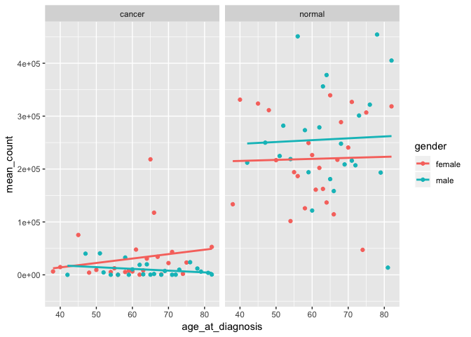
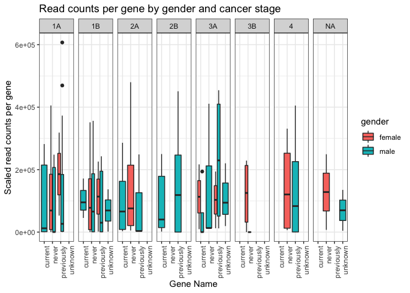

Analysis Report 2: Your Title Here
================
Maggie Chen
November 21, 2018

*Overall, a single-spaced page is about 500 words. So if the guidelines say half of a page, think about writing around 250 words. You can use the wordcountaddin in RStudio to track your progress.*

Introduction
============

Add about 1 page here. Must cite at least 5 peer reviewed articles.

Methods
=======

Sample origin and sequencing
----------------------------

Add about half a page here. In this section instead of first person (I/we), use Li et al. (Li *et al.*, 2015) and Seo et al. (Seo *et al.*, 2012), since you'll just be describing what they did, based on the methods in their paper(s). It's important to include this so the reader knows what the study design was for the data you will be presenting.

Computational
-------------

These are the methods that were used to process the sequencing data. Should probably be at least a half of a page. At a very minimum should include citations for biomartr, trimmomatic, and sailfish. Note that these three methods references don't count towards the five references you need to cite in the introduction.

Results
=======

In addition to a minimum of 4-5 figures/tables (and associated captions), you should include sufficient text in this section to describe what your findings were. Remember that in the results section you just describe what you found, but you don't interpret it - that happens in the discussion.

| genename | cancer\_stage | gender |  mean\_count|
|:---------|:--------------|:-------|------------:|
| SFTPC    | 3A            | male   |     410927.2|
| SFTPA2   | 3A            | male   |     384618.0|
| EEF1A1   | 3B            | female |     332712.5|
| SFTPA2   | 4             | female |     324913.2|
| SFTPC    | 2A            | female |     302853.6|
| SFTPA1   | 3A            | male   |     289754.2|
| EEF1A1   | 1A            | male   |     283534.1|
| SFTPC    | 4             | female |     278802.0|
| SFTPA2   | 1B            | male   |     278340.9|
| EEF1A1   | NA            | female |     273005.1|
| EEF1A1   | 3A            | male   |     255142.5|
| SFTPC    | NA            | female |     249256.1|
| SFTPC    | 1B            | male   |     243327.8|
| EEF1A1   | 1B            | female |     241703.4|
| SFTPC    | 1A            | male   |     227488.9|

**Table 1**:


**Figure 1**: The average gene expression levels in cancer and normal tissues. Categorized by smoking status, and colored by cancer stages. All four genes are highly expressed in the normal tissues, but they have different average expression levels in cancer tissues, and different cancer stages. EEF1A1 gene is relatively highly expressed in the cancer tissue. SFTPA1, SFTPA2, and SFTPC is down regulated in cancer tissues, in almost all cancer stages. SFTPC is mostly down regulated throughout all cancer stages.

``` r
# how SFTPC gene is expressed in all individuals(mean count of gene expression)
# samples from patients' both normal and cancer tissues
# along with the expression levels in different 
# cancer stages, and smoking status

joined_table %>%
  filter(genename %in% "SFTPC") %>%
  filter(smoking_status != "unknown") %>%
  filter(cancer_stage != "unknown") %>%
  group_by(normal_or_cancer, cancer_stage, smoking_status) %>%
  summarise(mean_count = mean(counts_lengthscaledtpm)) %>%
  ggplot(aes(x = smoking_status,
             y = mean_count,
             fill = cancer_stage)) +
    geom_col(position = "dodge") +
  facet_grid(~ normal_or_cancer) +
   theme(axis.text.x = element_text(angle = 90,
                         hjust = 1))
```


**Figure2**: In general, all cancer tissues has SFTPC gene significantly down regulated. Specifically, in never smokers, the SFTPC has showed some persistent to the down regulation in all cancer stages, especially later stages. For current and previous smokers, SFTPC are more down regulated than never smokers, with some outlier. For example, the 1B stage for the current smokers and the 3A stage for the previouslt smokers.

``` r
# Examine the average expression levels of SFTPC gene
# only for individals has both normal and cancer 
# tissue sampled, which based on smoking status
# and age at diagnosis

joined_table %>%
  filter(genename == "SFTPC") %>%
  filter(smoking_status != "unknown") %>%
  filter(normal_rnaseq == "yes") %>%
  group_by(normal_or_cancer, smoking_status, age_at_diagnosis) %>%
  summarise(mean_count = mean(counts_lengthscaledtpm)) %>%
  ggplot(aes(x = age_at_diagnosis,
             y = mean_count,
             color = smoking_status)) +
  geom_point() +
  geom_smooth(method = "lm",
              alpha = 0) +
  facet_grid(~ normal_or_cancer)
```


**Figure3**: Overall, SFTPC gene is highly down regulated in the cancer tissues. But highly expressed in normal tissues. Also, along with the smoking status of individuals. In cancer tissues, smoking will further decrease the gene expression levels along with increment of age at diagnosis. For previous and current smokers, SFTPC gene express in close to zero level and not change along with age change in the cancer tissue. In the cancer tissue from never smoker, the SFTPC expression level remains low, but increase with age increase. In normal tissues, for never smoker, the gene expression levels slightly decrease along with the increase of age. For normal tissues in current smokers, the gene expression is significantly decreased, while age increases. For normal tissue in previous smoker, the gene expression level increase, while age increases.

``` r
# How is the SFTPC gene expressed in cancer and normal tisse
# and how this differenct in each gender
# with age at daignosis as the disceret factor

joined_table %>%
  filter(genename == "SFTPC") %>%
  filter(smoking_status != "unknown") %>%
  filter(normal_rnaseq == "yes") %>%
  group_by(normal_or_cancer, gender, age_at_diagnosis) %>%
  summarise(mean_count = mean(counts_lengthscaledtpm)) %>%
  ggplot(aes(x = age_at_diagnosis,
             y = mean_count,
             color = gender)) +
  geom_point() +
  geom_smooth(method = "lm",
              alpha = 0) +
  facet_grid(~ normal_or_cancer)
```



**Figure3**: Firstly, for both male and female, SFTPC gene is down regulated in cancer tissue. In spit of, of the smoking stuats. In the cancer tisse, female has a increase trending of gene expression along with the increase of age, in contrast, male has a decrase gene expression level along with the age increase. As for the normal tissue, both male and female has an increase of SFTPC gene expression levels. Also, male has a higher average gene expression levels than females.

``` r
# Due to Figure2, 3 has different trending of SFTPC gene expression
# in normal tissues, to investigate this different
# this plot shows how in different gender, and smoking status
# will influence the SFTPC genes expression levels over age

joined_table %>%
  filter(genename == "SFTPC") %>%
  filter(smoking_status != "unknown") %>%
  filter(normal_rnaseq == "yes") %>%
  group_by(normal_or_cancer, gender, smoking_status,
           cancer_stage, age_at_diagnosis) %>%
  summarise(mean_count = mean(counts_lengthscaledtpm)) %>%
  ggplot(aes(x = age_at_diagnosis,
             y = mean_count,
             color = smoking_status,
             shape = normal_or_cancer)) +
  geom_point() +
   geom_smooth(method = "lm",
              alpha = 0) +
  facet_grid(~ gender)
```


**Figure4**:



Discussion
==========

Add around 1-2 pages interpreting your results and considering future directions one might take in analyzing these data.

Sources Cited
=============

Li,Y. *et al.* (2015) RNA-seq analysis of lung adenocarcinomas reveals different gene expression profiles between smoking and nonsmoking patients. *Tumor Biology*, **36**, 8993–9003.

Seo,J.-S. *et al.* (2012) The transcriptional landscape and mutational profile of lung adenocarcinoma. *Genome research*, **22**, 2109–2119.
