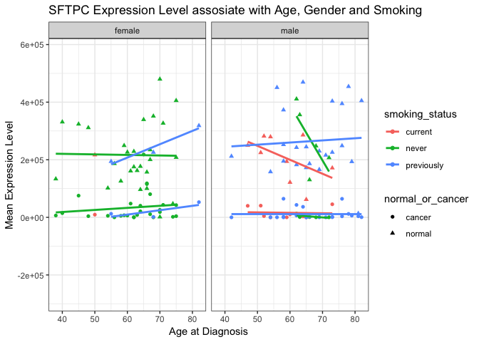

Smoking Further Downregulate the SFTPC Expression in both Normal and Cancer Lung Tissues
================
Maggie Chen
November 21, 2018

Introduction
============

Lung cancer is the most deadly cancer for both men and women in the US, which had exceeded the death rate combination of three most common cancer that is the colon, breast and pancreatic cancer (Siegel *et al.*, 2014). There are two main sub-type of lung cancer, small cell lung cancer and non-small cell lung cancer (NSCLC). NSCLC accounts for 85% of all lung cancers. NSCLC further classifies into three types, squamous-cell carcinoma, adenocarcinoma and large-cell carcinoma (Molina *et al.*, 2008). Adenocarcinoma arises from the typeII alveolar cell that forms the small airways. Adenocarcinoma is also the most common lung cancer found in both smoking and non-smoking population which accounts 30-40% of lung cancer regardless of gender and age (Couraud *et al.*, 2012). Smoking is the most prevalent risk factor for lung cancer in both male and female population. The length of smoking time and the amount of cigarettes people smoked is positively correlated to the risk of lung cancer (Powell *et al.*, 2013). Further study has also indicated the differences between smokers and nonsmoker's pathogenic mechanisms in lung cancer. For example, in adenocarcinoma, there is a distinct new molecular pathway in smoker's lung cancer development than non-smokers. What's more, those smoking-related genomic signatures in NSCLC can help predict cancer with 74% of accuracy (Massion *et al.*, 2008).

Nowadays, along with the improvement of sequencing techniques, RNA-Seq has become a sufficient method use the deep sequencing technology to profile transcriptome. RNA-Seq has provided a new view of eukaryotic transcriptome complexity. RNA-Seq also enables precise measurement of levels of transcripts and isoforms (Wang *et al.*, 2009). Compare to other sequencing technologies, like microarray, RNA-Seq has less background noise, and it is more sensitive regarding low abundance and high-fold expression change detection (Zhao *et al.*, 2014). As one of the examples, RNA-Seq was used to provide an insight of lung cancer development and its correlation with smoking. Its found that there are 27 genes expressed differently in human airway epithelial cells between smoker that has lung cancer and non-smoker without lung cancer (Cheng *et al.*, 2012). Li et al. has found several genes are either down-regulated or up-regulated in lung adenocarcinoma tissues using the data set from Seo et al., in which both Li et al. and Seo et al. have found smoking will contribute to the induction of gene expression dysfunction in tumor tissue, especially down-regulation of gene expression in tumor tissues (Li *et al.*, 2015). Then I was primarily interested in the questions of how lung adenocarcinoma will impact the lung function and the expression levels of the genes that support lung functions, in addition to genes identified by Li et al.

Thus, in this paper, I mainly focused on investigating the impact of smoking on genes that are highly expressed in healthy tissue, but down-regulated in cancer tissues. Also, to investigate whether there is a correlation between smoking, age, and gender on the gene expression level. I have found the SFTPC gene is highly downregulated in cancer tissues, which encodes the pulmonary-associated surfactant protein C (SPC). SPC is exclusively produced by type II alveolar cells, which prevents lung collapse by lowering the surface tension at the air-liquid interface in the lung (Clark and Clark, 2005). What's more, smoking cause the further down-regulation of SFTPC gene along with the increase of age at diagnosis. However, for previous and never smoker, there is no significant correlation between age and SFPTC gene expression levels. By understanding the underlying driven mutation or mechanism of lung adenocarcinoma, like when SFTPC gene is extensively downregulated by smoking, to increase the survival rate of patients, we can provide support to maintain the surface tension of alveolar cells. This will help provide a possible treatment to lung adenocarcinomas, especially when the patients is a current smoker. Understanding the underlying driver mutations that are induced by smoking can help us narrow down a range of possible mutation that threats the patients and provides adequate treatment faster.

Methods
=======

Sample origin and sequencing
----------------------------

Seo et al. sampled the original data from patients for both cancer and adjacent paired-normal tissue specimens via surgical specimens. Both cancer and normal tissues specimens were grossly dissected and preserved in liquid nitrogen immediately after surgery. Seo et al. used RNAiso Plus (Takara Bio Inc.) to extracted RNA from tissues for RNA-Seq, which is followed by using RNeasy MinElute (Qiagen Inc.) to purify the RNA samples. Assessment of RNA quality was quantified by using RNA 6000 Nano LabChip on a 2100 Bioanalyzer (Agilent Inc.). Seo et al. extracted genomic DNA from normal lung tissues for exome sequencing. Genomic DNA from each sample was sheared and used for the construction of paired-end sequence library from Illumina. The SureSelect Human all Exon 50Mb Kit (Agilent Inc.) was used according to the manufacturer's instruction to enrich the exonic sequences. Illumina TruSeq SBS Kit v3 on a HiSeq 2000 sequencer (Illumina Inc.) was used to sequence libraries for RNA and exome sequencing, 100-bp paired-end reads were obtained. Seo et al. also used the Illumina pipeline to perfom the image analysis and base calling with default settings. Total 200 of specimen samples was taken from patients, and 87 was sequenced using RNA-Seq. For those 87 individuals whose cancer specimens was RNA sequenced by Seo et al., smoking history before the diagnosis was provided for 83 of them, which includes 47 smokers, 36 never-smokers, and four unknowns. 23 out of 47 smokers has the amount of smoking available in the unit of pack-years (Seo *et al.*, 2012). Li et al. used the sequence data from Seo et al., Li et al. used the 68 lung adenocarcinoma patients' transcriptome sequences with validated smoking status from accession number GSE40419. Overall, there were about 14 billion paired-end sequence read an average length in 101bp. Also the phenotype data from the public website (<http://genome.cshlp.org/content/22/11/2109/suppl/DC1>), which include gender, age at diagnosis, and smoking history. There are 34 smokers and 34 non-smokers in the 68 total samples. Li et al. have also downloaded RNA-Seq data from six non-smoker patients from accession number GSE337765.

Computational
-------------

First of all, I created a bash script to download the RNA-Seq sequencing file and install tools for analysis. Then I created an R script to install biomartr package which helps retrieve all or selected genomic data, promote, coding sequences, and annotations in NCBI (Drost and Paszkowski, 2017). Thus, I used it to download the reference genome, transcript, and genome annotations from NCBI human genome RefSeq. Then I converted the paired-end sequence sra files into fastq files using a bash script. After that, I created index of kmers for sailfish quasi-aligner in a bash script. Sailfish is a novel computational method that avoids mapping read to quantify the abundance of previously annotated RNA isoform from RNA-Seq data at a fast speed (Patro *et al.*, 2014). After it, I use the bash script to run the fastqc on all fastq files and save the output to the output directory. Then I trimmed the paired-end reads in parallel using trimmonatic which is a tool to trim Illumina NGS data, help remove the adopter, remove low-quality bases (Bolger *et al.*, 2014). In this project, I trimmed any reads that drop below 20 in a window size of 4 based on the fastqc output. To ensure all the sequence files are trimmed I created another script to check whether the files are trimmed, if not then run the trimmomatic. Then use the result of trim, I make a script to run sailfish to count all reads from trimmed reads where both paired reads (Forward and Reverse) made it through trimmomatic check (Patro *et al.*, 2014). Then, in order to construct a transcript to the gene ID mapping table. In the bash script, I firstly construct a non-redundant list of Genbank ID to gene names, which is from sailfish quant output and make that the first column of output file. Secondly, grep over first column in quant.sf files to find Genbank ID and then add gene name as the second column, and make sure this gets loaded into R. Lastly, I created an R script to read in all of the transcript counts made by sailfish individually on each sample, with aggregate the transcript level counts to the gene level. Then normalize them based on length and read depth, and then build a table with rows as genes and columns as samples, with each cell being the normalized count for that gene in that sample. Then, I joined the two other metadata files we have, from SRA and from the supplementary table from the original manuscript that has information like patient age and smoking behavior. I also melted the output file only to include interesting columns, and write out the output in compressed csv format as well as binary RData format.

Results
=======

First of all, to investigate the critical genes that maintain the healthy lung function. I listed out the top fifteen most highly expressed genes in never smokers' normal tissues (Table1). The expression levels are measured as the mean count of normalized expression count and then categorized in cancer stages. For never smokers that has stage 3A lung cancer, in their normal tissue the SFTPC gene has the highest average expression level across all samples, then SFTPA2 gene in stage 3A never smokers, and then the EEF1A1 gene in stage 3B never smokers is also relatively highly expressed. Each sample is recognized as an independent individual and grouped into cancer stages which creates some repeated genes in the table (Table1). What's more, for individuals listed in Table1, most of them are in cancer stage 3, which is the relative later and sever stages. Then extract the unique genes from the Table1, that is SFTPC, SFTPA1, SFTPA2, EEF1A1, and SFTPB gene, to examine their expression levels in different tissue type, normal or cancer, and different cancer stages. As a result, all five genes are highly expressed in the normal tissues, but they have different average expression levels in cancer tissues, and different cancer stages. EEF1A1 gene is relatively highly expressed in the cancer tissue with minimal down-regulation, mostly on stage 3B and 4. SFTPA1, SFTPA2, and SFTPC are more down-regulated in cancer tissues then normal tissues, in almost all cancer stages. SFTPA1 and SFTPA2 gene expression are relatively down-regulated in stages other 2B. SFTPB gene is mostly down-regulated in stage 3B and stage 4. SFTPC is mostly down-regulated throughout all cancer stages. As SFTPC gene is mostly down-regulated in cancer tissues, more importantly throughout all cancer stages (Figure1). Next, I specifically focused on how the SFTPC gene expression level is impacted by smoking. Overall, all cancer tissues have SFTPC gene significantly down-regulated. Specifically, for current and previous smokers' cancer tissues there is an irregular pattern, but mostly more downregulation than never smokers with some outliers. For example, the 1B stage for the current smokers and the 3A stage for the previously smokers. In contrast, in never smokers' cancer tissues, the SFTPC has shown some persistent to the down-regulation in all cancer stages, especially later stages. In addition, in the normal tissues, current smokers have a lower SFTPC gene average expression levels than never and previous smokers (Figure2). After observing current smoking status will impact the SFTPC gene expression levels with some irregular pattern, then I further include the age at diagnosis as a variable to investigate how smoking will impact the SFTPC gene expression along with age at diagnosis in both normal and cancer tissues. SFTPC gene is highly down-regulated in the cancer tissues, which has gene mean expression levels close to zero. For previous and current smokers' cancer tissues, SFTPC gene expression is closer to zero than never smokers and not change along with age change in the cancer tissue. In the cancer tissue from never smokers, the SFTPC expression level remains low, but there is a slight increase with age increase due to two outliers at the age of 65; otherwise, there is a small correlation with age at diagnosis. In contrast, the SFTPC gene is significantly highly expressed in normal tissues. Also, along with the smoking status of individuals, in normal tissues, for never smoker, the gene expression levels slightly decrease along with the increase of age, which is insignificant. For normal tissues from current smokers, the gene expression decreased significantly, while age increases. For normal tissue from previous smokers, the gene expression level increase not significantly, while age increases. Knowing current smoking status will decrease SFTPC expression in normal tissues along with age at diagnosis, I was curious about how gender will associate with it (Figure3). Thus, lastly, I examined the relationship between the average SFTPC gene expression levels, gender and smoking status. As a result, comparing the SFTPC gene expression levels in male and female independently, cancer tissues has SFTPC gene significantly down-regulated than normal tissues. Compare across male and female cancer tissue samples; female has SFTPC expressed slightly more than males cancer tissues. In the comparison of tissue types, female samples are dominated by never smokers with a few previous smokers' samples. Male samples are abundant in previous smokers and current smokers, with a minimal sample amount of never smokers. Thus, for female never smokers the SFTPC expression levels are not changed significantly along with age at diagnosis. For the current male smoker, SFTPC gene's mean expression levels decrease significantly while the age at diagnosis increases. For previous male smokers, age at diagnosis does not influence the SFTPC expression levels (Figure4).

| genename | cancer\_stage |  mean\_count|
|:---------|:--------------|------------:|
| SFTPC    | 3A            |     410927.2|
| SFTPA2   | 3A            |     384618.0|
| EEF1A1   | 3B            |     332712.5|
| SFTPA2   | 4             |     324913.2|
| SFTPC    | 2A            |     302853.6|
| SFTPA1   | 3A            |     289754.2|
| SFTPC    | 4             |     278802.0|
| EEF1A1   | NA            |     273005.1|
| EEF1A1   | 3A            |     255142.5|
| SFTPC    | NA            |     249256.1|
| EEF1A1   | 1B            |     237772.8|
| SFTPA1   | 4             |     219476.8|
| SFTPC    | 3B            |     218549.3|
| SFTPA2   | 3B            |     217719.4|
| SFTPB    | 3A            |     215765.9|

**Table 1**: Top fifteen genes that is most highly expressed in never smoker's normal tissues. The expression levels are measured as the mean count of normalized expression count and then categorized in cancer stages. For never smokers that has stage 3A lung cancer, in their normal tissue the SFTPC gene has the highest average expression level across all samples, then SFTPA2 gene in stage 3A never smokers, and then the EEF1A1 gene in stage 3B never smokers is also relatively highly expressed. Each sample is recognized as an independent individual and grouped into cancer stages which creates some repeated genes in the table.

**Figure 1**: The average gene expression levels in cancer and normal tissues. Categorized by smoking status, and colored by cancer stages. All five genes are highly expressed in the normal tissues, but they have different average expression levels in cancer tissues, and in different cancer stages. EEF1A1 gene is relatively highly expressed in the cancer tissue with minimal down-regulation, mostly on stage 3B and 4. SFTPA1, SFTPA2, and SFTPC are more down-regulated in cancer tissues, in almost all cancer stages. SFTPA1 and SFTPA2 gene expression are relatively down-regulated in stages other 2B. SFTPB gene is mostly downregulated in stage 3B and stage 4. SFTPC is mostly down regulated throughout all cancer stages.

**Figure2**: SFTPC gene expression levels' association with smoking status and different cancer stages, tissue types. Categorized by smoking status and tissue types, colored by cancer stages. Overall, all cancer tissues has SFTPC gene significantly down regulated. Specifically, for current and previous smokers' cancer tissues there is a irregular, but mostly more down regulation than never smokers with some out-liers. For example, the 1B stage for the current smokers and the 3A stage for the previously smokers. In contrast, in never smokers' cancer tissues, the SFTPC has showed some persistent to the down regulation in all cancer stages, especially later stages. In addition, in the normal tissues, current smoker has a lower SFTPC gene average expression levels than never and previous smokers.

**Figure3**: SFTPC gene expression levels' association with age at diagnosis and smoking status. Use age at diagnosis as the continuous variable and categorize into tissues types and colored by smoking status. Overall, SFTPC gene is highly down regulated in the cancer tissues, which has gene mean expression levels close to zero.For previous and current smokers' cancer tissues, SFTPC gene expression is closer to zero than never smokers and not change along with age change in the cancer tissue. In the cancer tissue from never smoker, the SFTPC expression level remains low, but there is a slight increase with age increase due to two outliers at age of 65, otherwise, there is a small correlation with age at diagnosis. But SFTPC gene is significantly highly expressed in normal tissues. Also, along with the smoking status of individuals, in normal tissues, for never smoker, the gene expression levels slightly decrease along with the increase of age, which is in-significant. For normal tissues from current smokers, the gene expression is significantly decreased, while age increases. For normal tissue from previous smoker, the gene expression level increase not significantly, while age increases.

**Figure4**: SFTPC gene expression levels in different genders and its correlation with age at diagnosis and smoking status. Age at diagnosis is the continuous variable and categorized into gender and colored by smoking status, points are shaped by tissue types. Compare the SFTPC gene expression levels in male and female independently. Cancer tissues has SFTPC gene significantly down regulated, than in normal tissue. Compare across male and female cancer tissue samples, female has SFTPC expressed slightly higher than males cancer tissues. In comparison of tissue types, female samples are dominated by never smokers with a few previous smokers' samples. Male samples are abundant in previous smokers and current smokers, with very small sample amount of never smokers. Thus, for female never smokers the SFTPC expression levels is not changed significantly along with age at diagnosis. For male current smoker, SFTPC mean expression levels decrease significantly while age at diagnosis increases. For male previous smokers, age at diagnosis is does not influence the SFTPC expression levels.

Discussion
==========

The five highly expressed genes in never smokers' normal tissues are SFTPC, SFTPA1, SFTPA2, EEF1A1, and SFTPB gene. They all serve different roles in lung functions. EEF1A1 encodes for a subunit of Eukaryotic translation elongation factor-1, which help delivery aminoacyl tRNA to the ribosome (Sanders *et al.*, 1996). This is very likely to be a housekeeping gene that even cancer cells need translation to produce proteins; thus it is not significantly down-regualted in cancer tissues when comparing to normal tissues. SFTPA1 and SFTPA2 both belong to the collection of SPA, which helps noninflammatory in the lung by stimulating immunoreceptor on alveolar cells (Greene *et al.*, 2003). Cancer development has involved tightly with inflammatory responses of immunosystem but not much about the noninflammatory responses (Coussens and Werb, 2002). Thus SFTPA1 and SFTPA2 are not highly down-regulated in cancer tissues. SFTPB gene encodes for pulmonary-associated surfactant B protein (SPB), which has a similar function as SFTPC that is to help prevent lung collapse and lowering surface tension at the air-liquid interface of alveoli in the lung. Both SFTPC and SFTPC encodes proteins as part of the surfactant (Clark *et al.*, 1995). SFTPB gene has also been down-regulated in cancer tissues, but not as much as SFPTPC gene (Figure1). However, lung adenocarcinoma specifically target the SFTPC might due to SFTPC is exclusively expressed on type II alveolar cells in the lung than SFTPB gene, to reach higher efficiency. However, more investigation is needed.

In conclusion, in the same individual lung cancer tissue has a significant lower SFTPC expression level, which might lead to a significant loose of lung function due to the lung collapses. SFTPC is an essential gene for typeII alveolar cells in the lung, which is also the main location of adenocarcinoma development. Morever, this loose of normal lung function will lead to a high death rate of lung adenocarcinoma since the SFTPC gene is vital for breathing and oxygen transportation from air to blood. Besides, typeII alveolar cells also protect lung from invasion of pathogens, which means the loose of alveolar typeII cell function will increase the chance of getting lung infections (Fehrenbach, 2001). Also, smoking, especially current male smokers will have more down-regulated SFTPC gene expression levels in normal tissues along with the increase of age at diagnosis. This provides one of the possible reasoning that adenocarcinoma is the most common type of NSCLC, due to the large smoking population. The decreased SFTPC expression in typeII alveolar will increase the chance of smoker patients affected by adenocarcinoma NSCLC. Also, the elderly male current smoking population is more vulnerable to the adenocarcinoma NSCLC. However, previous male smokers are less likely to experience the extensive down-regulation of SFTPC expression levels as the current male smokers. What's more, for female never-smokers, SFTPC gene expression levels remain relatively constant along with the increase of age at diagnosis. Thus, stop smoking as soon as possible or stay away from smoking will be sufficient to increase the survival rate of lung cancer, specifically adenocarcinoma NSCLC.

There are also several limitations to this paper. Firstly, the female samples are dominated by never smokers; thus we need more data and samples to ensure the observation and conclusions reached in male samples can apply to female populations. Also, for male samples there is a minimal amount of never smokers. Thus, we need more samples to ensure that the conclusion we reached in females can apply to male never smokers. Secondly, SFTPC is highly expressed in type II alveolar cells (Clark and Clark, 2005). However, all the samples are from lung adenocarcinoma patients; thus I can only limit the finding of how SFTPC is impacted by smoking to lung adenocarcinoma. Also, all the samples are from patients in Korean, which is not inclusive to all the human population. Thus, we need to include more diverse human samples to investigate whether the down-regulation of SFTPC gene by smoking applies to all human populations. Lastly, for previous smokers, there is no data about how many years they have quit smoking. There might be a correlation between the time of stop smoking and re-store of SFTPC expression levels. Thus, have a more variant sample set to include different types of cancer, human race and years of stop smoking will further expand the applications of this finding or provide a race-specific effect of smoking on lung cancers.

In summary, the SFTPC gene is highly expressed in more lung typeII alveolar cells, which is significant to lung function. Lung cancer will significantly down-regulate the expression of the SFTPC gene in all cancer stages. Furthermore, smoking, especially current smoking status will make patients more vulnerable to lung cancer, and at older ages of diagnosis. In order to further down-regulate the SFTPC gene expression, there might be some new pathway activated by the compound in cigarettes to down-regulate the SFTPC gene expression directly or up-regulate the regulatory factor of SFTPC gene expression. However, this still remains in question and needs further research and evidence. What's more, based on the understanding of smoking down-regulatea the SFTPC expression levels in normal tissue, this can function as a prediction to the likely-hood of the individual to get lung adenocarcinoma or even other lung diseases. Also, for current smokers, lung adenocarcinoma treatment that helps restore the surface tension of lung cells can help improve the survival rate.

Sources Cited
=============

Bolger,A.M. *et al.* (2014) Trimmomatic: A flexible trimmer for illumina sequence data. *Bioinformatics*, **30**, 2114–2120.

Cheng,P. *et al.* (2012) Comparison of the gene expression profiles between smokers with and without lung cancer using rna-seq. *Asian Pacific Journal of Cancer Prevention*, **13**, 3605–3609.

Clark,H. and Clark,L.S. (2005) The genetics of neonatal respiratory disease. In, *Seminars in fetal and neonatal medicine*. Elsevier, pp. 271–282.

Clark,J.C. *et al.* (1995) Targeted disruption of the surfactant protein b gene disrupts surfactant homeostasis, causing respiratory failure in newborn mice. *Proceedings of the National Academy of Sciences*, **92**, 7794–7798.

Couraud,S. *et al.* (2012) Lung cancer in never smokers–a review. *European journal of cancer*, **48**, 1299–1311.

Coussens,L.M. and Werb,Z. (2002) Inflammation and cancer. *Nature*, **420**, 860.

Drost,H.-G. and Paszkowski,J. (2017) Biomartr: Genomic data retrieval with r. *Bioinformatics*, **33**, 1216–1217.

Fehrenbach,H. (2001) Alveolar epithelial type ii cell: Defender of the alveolus revisited. *Respiratory research*, **2**, 33.

Greene,K.E. *et al.* (2003) By binding sirp?‘ or calreticulin/cd91, lung collectins act as dual function surveillance molecules to suppress or enhance inflammation. *Cell*, **115**, 13–23.

Li,Y. *et al.* (2015) RNA-seq analysis of lung adenocarcinomas reveals different gene expression profiles between smoking and nonsmoking patients. *Tumor Biology*, **36**, 8993–9003.

Massion,P.P. *et al.* (2008) Smoking-related genomic signatures in non–small cell lung cancer. *American journal of respiratory and critical care medicine*, **178**, 1164–1172.

Molina,J.R. *et al.* (2008) Non-small cell lung cancer: Epidemiology, risk factors, treatment, and survivorship. In, *Mayo clinic proceedings*. Elsevier, pp. 584–594.

Patro,R. *et al.* (2014) Sailfish enables alignment-free isoform quantification from rna-seq reads using lightweight algorithms. *Nature biotechnology*, **32**, 462.

Powell,H.A. *et al.* (2013) The association between smoking quantity and lung cancer in men and women. *Chest*, **143**, 123–129.

Sanders,J. *et al.* (1996) Immunofluorescence studies of human fibroblasts demonstrate the presence of the complex of elongation factor-1 beta gamma delta in the endoplasmic reticulum. *Journal of Cell Science*, **109**, 1113–1117.

Seo,J.-S. *et al.* (2012) The transcriptional landscape and mutational profile of lung adenocarcinoma. *Genome research*, **22**, 2109–2119.

Siegel,R. *et al.* (2014) Cancer statistics, 2014. *CA: a cancer journal for clinicians*, **64**, 9–29.

Wang,Z. *et al.* (2009) RNA-seq: A revolutionary tool for transcriptomics. *Nature reviews genetics*, **10**, 57.

Zhao,S. *et al.* (2014) Comparison of rna-seq and microarray in transcriptome profiling of activated t cells. *PloS one*, **9**, e78644.
